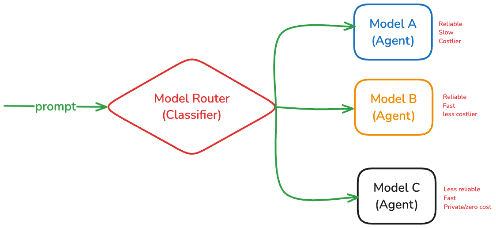

# Introduction
In this example we define 3 agents, which are basically 3 different models. Based on the model description the classifier picks a model and route the request to appropriate model. Take a look at Test example prompts below (last section) and experiment with more model descriptions and models.

## Architecture




To set up and run the application first install dependencies from `requirements.txt` file, follow these steps:

### Prerequisites

- Ensure you have Python installed on your system. It's recommended to use Python 3.7 or higher.
- Make sure you have `pip`, the Python package installer, available.
- Make sure you have [`ollama`](https://ollama.com/) installed and running the model specified in `ollamaAgent.py`

### Steps

1. **Clone the Repository (if necessary)**

   If you haven't already, clone the repository containing the application code to your local machine.

   ```bash
   git clone <repository-url>
   cd <repository-directory>
   ```

2. **Create a Virtual Environment (Optional but Recommended)**

   It's a good practice to use a virtual environment to manage dependencies for your project.

   ```bash
   python -m venv venv
   ```

   Activate the virtual environment:

   - On Windows:

     ```bash
     venv\Scripts\activate
     ```

   - On macOS and Linux:

     ```bash
     source venv/bin/activate
     ```

3. **Install Dependencies**

   Use the `requirements.txt` file to install the necessary Python packages.

   ```bash
   pip install -r requirements.txt
   ```

4. **Run the Application**

   Use the `chainlit` command to run the application.

   ```bash
   chainlit run app.py -w
   ```

### Additional Information

- Ensure that any environment variables or configuration files needed by `multi_agent_orchestrator` or other components are properly set up.
- If you encounter any issues with package installations, ensure that your Python and pip versions are up to date.

By following these steps, you should be able to install the necessary dependencies and run the application successfully.

### Sample test questions
#### Testing for cost vs. reliability
- answer this at lowest cost possible: why is the sky blue?
   - This should call local Ollama agent as the cost is zero
- give me most reliable answer for this: why is the sky blue?
   - This should call Sonnet as its the most reliable
- Answer this with a good balance of cost and reliability: why is the sky blue?
   - This should call Haiku as its the middle ground between cost and reliability

#### Testing for speed, privacy and reliability
- process following information securely preserving privacy of customers. extract entities from this statement. "linda filed a case against kyle"
   - This should most likely select the local model ollama as its private
- extract entities from this statement. "linda filed a case against kyle"
   - this should select most capable model, Sonnet as there are no constraints
- I need to extract information reliably from this but keep the cost down . extract entities from this statement. "linda filed a case against kyle"
   - This should select Haiku as its the middle ground between cost and reliability

